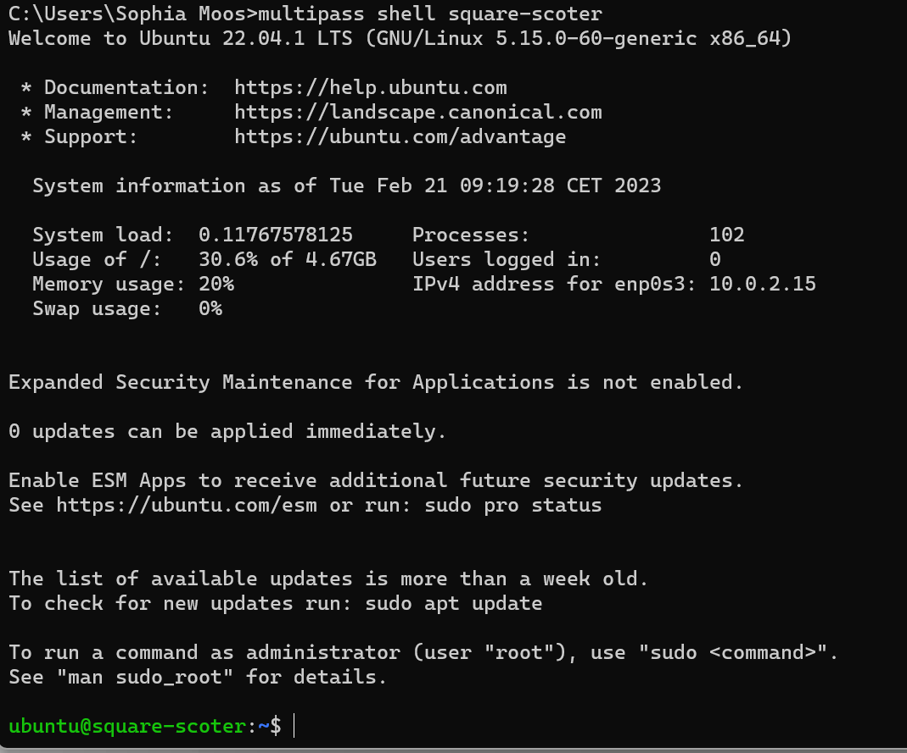
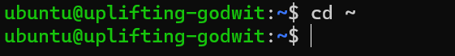

# JaSch_Modul346

##Aufsetzen von zwei VM's
###confident-group & square-scoter

##Starten und Stoppen Sie die Instanz via Command Line (Konsole)
###Beweis, dass die Vm's momentan auf "Running" stehen

###Stoppen von square-scoter

###Starten von Square-Scoter

##Ändern Sie die Anzahl CPU der Instanz
###Vor der Anpassung CPU=1

###Nach der Anpassung CPU=2

##Rufen Sie die Shell der Instanz auf (Linux Bash)
###Shell für square-scoter gestartet

##Löschen Sie eine Instanz (permanent!).
###Ordner vor dem Löschen

###Löschvorgang

###Nach dem Löschen

##Ausführen der folgende Befehle
###sudo apt update

###sudo apt install apache2

###sudo apt install php

###sudo apt install libapache2-mod-php

###sudo apt install mariadb-server

###sudo apt install php-mysqli

###sudo mysql -sfu root -e "GRANT ALL ON *.* TO 'admin'@'%' IDENTIFIED BY'password' WITH GRANT OPTION;"

###cd ~

###git clone https://gitlab.com/ch-tbz-it/Stud/m346/m346scripts.git

###sudo cp ./m346scripts/KN01/*.php /var/www/html/
###IP

###Windows 10

