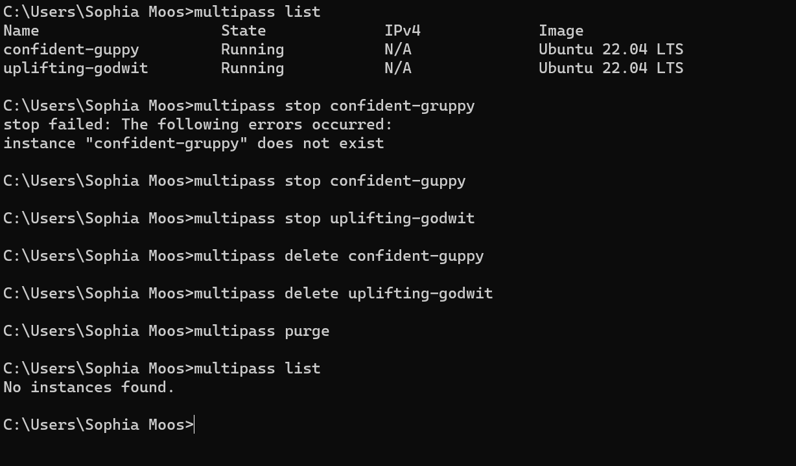

# KN02

## Vorbereitung
### Alte Instanz Löschen 

## Cloud-init Datei verwenden
### Neue Instanz erstellen 

### Die IP mittels curl imitieren

###  Den Apache2 Server starten 

## Cloud-init Datei ändern und erstellen
### Adminer installiert und im Browser aufgerufen

### DB und Info mittels curl ausgeführt
#### Lösung, da wir die IP nicht ausrufen konnten

