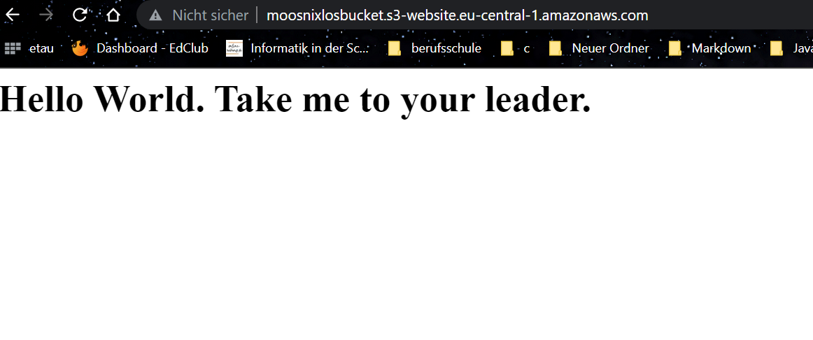
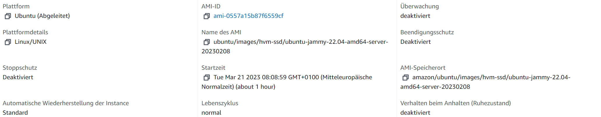

# Dokumentation K03
***

## A.) AWS Kurs

### Lab 4.1 - EC2
 

**HTML-Page inklusive URL:**

Auf dem folgendem Bild sieht man, wie man über die IP-Adresse meiner Instanz eine eingefügte HTML-Seite aufrufen kann.

***

**Liste der EC2-Instanzen**

Auf diesem Bild, sieht man meine existierenden Instanzen.

***

**Details der Web Server-Instanz (öffentliche IP sichtbar)**

Hier sieht man die öffentliche IP-Adresse meiner Instanz, über welche auch die HTML-Page aufgerufen wurde.

***

**Security-Group: Liste der Inbound-Regeln**

Auf diesem Bild kann man die Security-Group meiner Instanz sehen genau wie die Liste von den Regeln.

***

### Lab 4.2 - S3
 

**Liste der Buckets**

Auf diesem Bild sind meine Buckets aufgelistet.

***

**HTML-Seite, inkl. URL**

Hier sieht man die HTML Seite, welche in sich in meinem Bucket befindet und über den URL aufgerufen werden kann.

***

**Liste der Dateien im Bucket**

Dieses Bild zeigt alle Datein welche sich in meinem Bucket befinden.

***

**Eigenschaften von "Static website hosting"**

Hier kann man die Eigenschaften von Static website hosting von meinem Bucket sehen.

***

## B) Zugriff mit Passwort

**Ubuntu 22.04**
Es wurde Ubuntu 22.04 als System ausgewählt.

***

**Vockey-Key**
Bei "Key pair" wurde "Vockey gewählt".

***

**Cloud-init-true-false**
Could-Init Settings sind auf true und false gesetzt.

Ergebnis im CMD:

***

**Could-init-false-false**
Could-Init Settings sind auf false und false gesetzt.

Ergebnis im CMD: 

***

## C) Zugriff mit SSH-Key

**Zwei Key-Pairs**
Zwei Key-Pairs wurden neu erstellt und lokal abgespeichert.

*** 

**Key1 ausgewählt**
Der Key1 wurde ausgewählt.

*** 

**Login CMD**
Nicht funktionierendes Login mit KeyPair2:

Funktionierendes Login mit KeyPair1:

*** 

## D) SSH-Key und Cloud-init

**Key-Pair Einstellung**
KeyPair2 wird ausgewählt.

*** 

**Cloud-Init**

Oberer ausgewählter "KeyPair2" wird mit Could-Init Konfig überschrieben.

*** 

**Testing CMD**
Jedes login failed, ausser das mit dem richtigen User und dem richtigen Key (KeyPair1).

