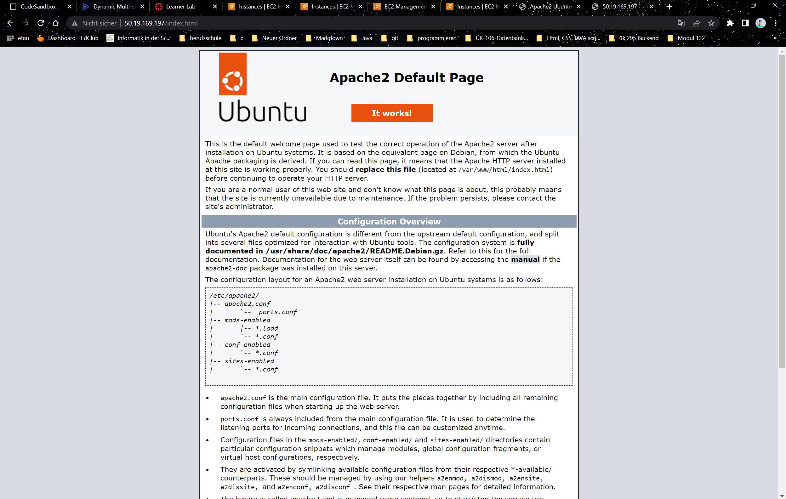
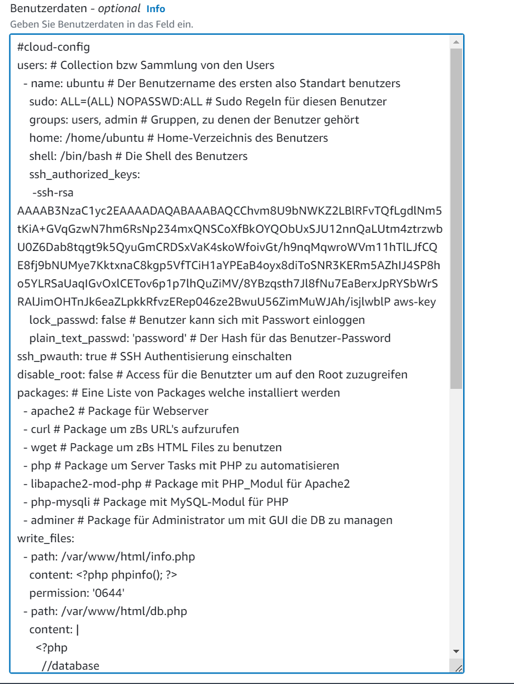

# K04 Dokumentation K04

***
## A.)

** Bei dieser Aufgabe habe ich sehr viel zeit verschwendet, nur um am ende heraus zufinden, das eine config datei falsch war. Die datei 50-server.cnf beinhält eine Zeile ```bind-address``` , welche auf ```127.0.0.1``` gesetzt ist, damit die DB allerdings auf ausenstehende verbindungen hört, muss dieser Wert auf ```0.0.0.0``` gesetzt werden.**


*** 

<br>

Liste meiner zwei Instanzen:


***

IP-Adresse der DB und der Web Instanz:


***

Die Seiten welche über die Ip-Aufgrufen wurden:





***

Cloud-Init-Datein:




***
## B.)

**Erklärung**:
Der S3-Speicher würde meiner Meinung nach in die Kategorie "Warm" oder sogar "Hot Storage" eingestuft werden, da er häufiger darauf zugegriffen wird, jedoch nicht so häufig wie beispielsweise auf das Stammvolumen. Allerdings hängt dies vom Verwendungszweck des Buckets ab. Wenn es sich um ein Backup handelt, würde ich es eher in die Kategorie "Cold Storage" einordnen, da es nicht so häufig abgerufen wird.

***

**Zuvor:**


**Danach:**


**Key:**

*AAAAB3NzaC1yc2EAAAADAQABAAABAQCChvm8U9bNWKZ2LBlRFvTQfLgdlNm5tKiA+GVqGzwN7hm6RsNp234mxQNSCoXfBkOYQObUxSJU12nnQaLUtm4ztrzwbU0Z6Dab8tqgt9k5QyuGmCRDSxVaK4skoWfoivGt/h9nqMqwroWVm11hTlLJfCQE8fj9bNUMye7KktxnaC8kgp5VfTCiH1aYPEaB4oyx8diToSNR3KERm5AZhIJ4SP8ho5YLRSaUaqIGvOxlCETov6p1p7lhQuZiMV/8YBzqsth7Jl8fNu7EaBerxJpRYSbWrSRAlJimOHTnJk6eaZLpkkRfvzERep046ze2BwuU56ZimMuWJAh/isjlwblP*
