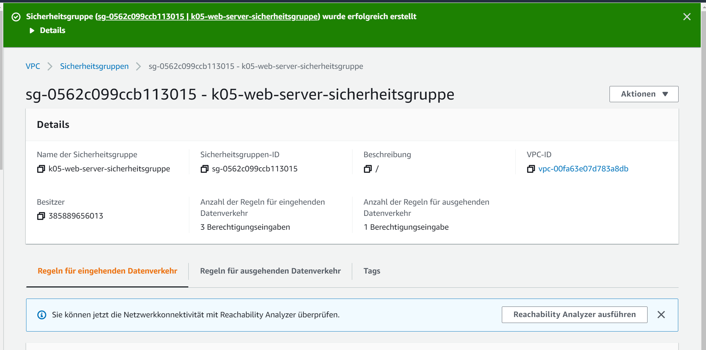
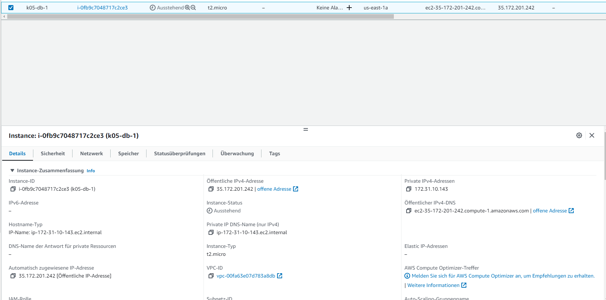

# K04 Dokumentation K05

***
## A.)

Für diesen Teil der Abgabe, musste ich meine Instanzen und die dazu gehörige Dinge löschen.

***

## B.)

**Subnetz**

Als erstes musste ich ein Subnetz erstellen. Dazu habe ich folgende Einstellungen ausgewählt.

Nach dem ich das Subnetz erfolgreich erstellt hatte sah meine Liste so aus.

***

**Elastic IPs**

Als nächstes habe ich eine Elastic IP-Adresse erstellt. Diese habe ich für den Rest des Auftrags verwendet.

***

**Security Groups**

Für den weiteren Teil des Auftrags, habe ich zwei Sicherheitsgruppen erstellt. Die eine sollte für die Datenbank und die andere für die Web-Instanz dienen. 

Für die DB-Instanz habe ich folgende Einstellungen gewählt.

Für die Web-Instanz habe ich folgende Regeln defniert.

Nachdem ich die beiden Sicherheitsgruppen erstellt hatte, sah meine Liste so aus.

Wie man sieht, habe ich zwei default Sicherheitsgruppen, welche ich schon im voraus hatte und nicht löschen konnte und meine beiden kürzlich erstellten Sicherheritsgruppen.

Ich habe ebenfalls noch je einen Screenshot gemacht, worauf man sieht was mir nach dem erstellen einer Sicherheitsgruppe angezeigt wurde. 

Screenshot für die DB-Sicherheitsgruppe:

Screenshot für die Web-Sicherheitsgruppe:

***

**Netzwerk-Interfaces**

Hier habe ich ebenfalls zwei Netzwerk-Interfaces erstellt, wieder eine für das Web und eine für die Datenbank. 

*Leider habe ich später beim erstellen der Web-Instanz einen Fehler gemacht und diesen erst bemerkt, als ich mich mit adminer einloggen wollte. Daher stimmen die Ip-Adressen hier bei dem Web-Netzwerk-Interface nicht mit der von den Screenshots der Datein (Index.html, info.php etc) überein. Falls Sie zweifel haben an der Echtheit meiner Screenshots haben, können Sie diese gern selbst auf AWS überprüfen.*

Einstellungen des Web-Netzwerk-Interface:

Einstellungen des DB-Netzwerk-Interfaces:

Ebenfalls habe ich Screenshots davon gemacht, wie die Netzwerk-Interfaces in der Liste aussehen.

***

**Instanzen**

Zuerst habe ich logischerweise die Datenbank-Instanz erstellt. Alle Wichtigen Einstellungen, welche ich machen musste, damit alles Funktioniert, habe ich dokumentiert. 

Nachdem ich die Instanz erstellt hatte, konnte ich folgende Infos über die Instanz sehen.

Das gleiche habe ich Natürlich auch für die Web-Instanz gemacht. Jedoch habe ich logischerweise andere Einstellungen genommen.

Auch hier habe ich wieder folgende Infos nach dem erstellen der Instanz erhalten.

Anschliessend habe ich die Seiten über den Web-Server aufgerufen.

Index.html:

Info.php:

Adminer:
