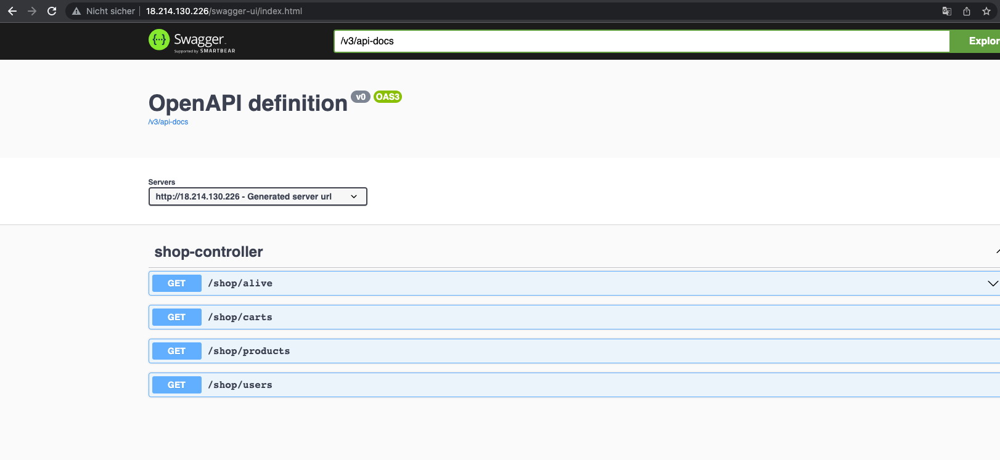
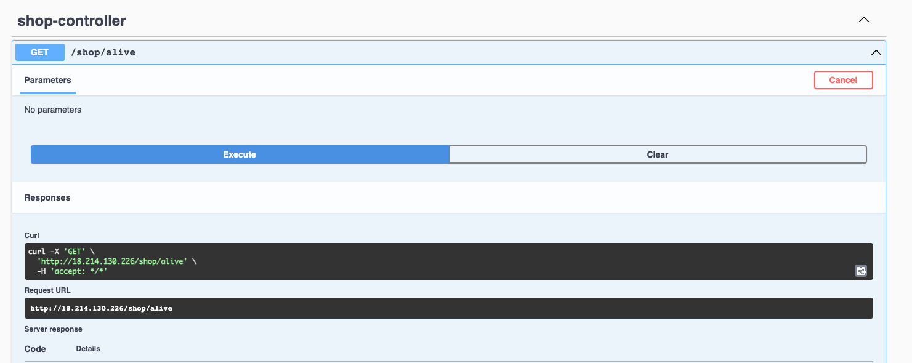
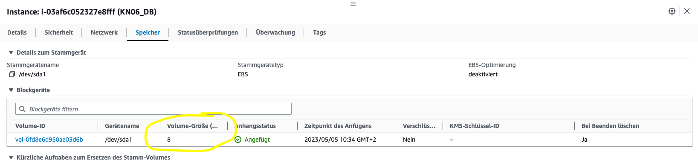
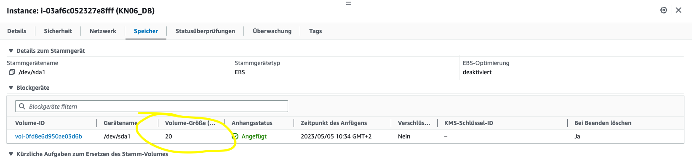
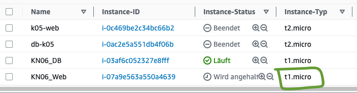
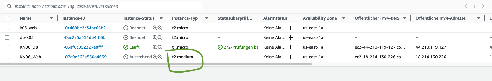
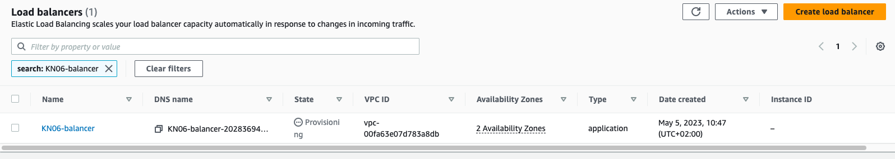

# K06 Dokumentation Skalierung

*Da ich das K06 in den Ferien gemacht habe, habe ich zu den Abgaben noch einen Text verfasst, damit ich die Kompetenz abgeben kann. Ich hoffe dieser Text kann im Fall von Zeitmangel das Gespräch mit dem Lehrer ersetzen.*

## A.) Installation App

Hier sieht man, dass ich Swagger über meine Instanz aufrufen konnte.

Danach habe ich einen API-Call auf einen Endpoint gemacht. Dies habe ich (wie laut Vorgaben), mit Swagger gemacht.

*** 

## B.) Vertikale Skalierung

In dieser Aufgabe musste ich meine Instanz vertikal Skalieren, also ihr mehr Ressourcen zuteilen. Durch das kann man die Leistungsfähigkeit und die Kapazität erhöhen. Ich musste die Disk des DB-Servers auf 20GB erweitern.

Hier die DB-Instanz vor dem Skalieren:

Nach der Skalierung sah das Ergebnis so aus:

Danach musste ich auch noch die Web-Instanz skalieren, bevor ich das Gemacht habe, sah das ganze so aus:

Nachdem ich die Instanz skaliert hatte und den Instanztyp von **t1.micro** auf **t2.medium** gewechselt habe, sah das ganze so aus:

***

## C.) Horizontale Skalierung

Als erstes habe ich einen Load Balancer erstellt, welchen man im folgenden Bild sieht.

Als ich den Auftrag machen musste, habe ich mich gefragt, was diese Einzelnen Objekte eigentlich sind und hier ist meine Erklärung.

**Balance Loader**

Ein Load Balancer ist ein zentraler Kontaktpunkt für Clients. Dieser verteilt eingehenden Datenverkehr auf meine Instanzen. Die Instanzen sind wie das Ziel und der Load Balancer die Kreuzung. Zumindest habe ich es so verstanden. Durch den Elastic Load Balancer Service wird mein Load Balancer je nach eingehenden Datenverkehr skaliert. Ausserdem kann der Load Balancer Ziele (also Instanzen) aus mehreren Availability Zones ansprechen. 

