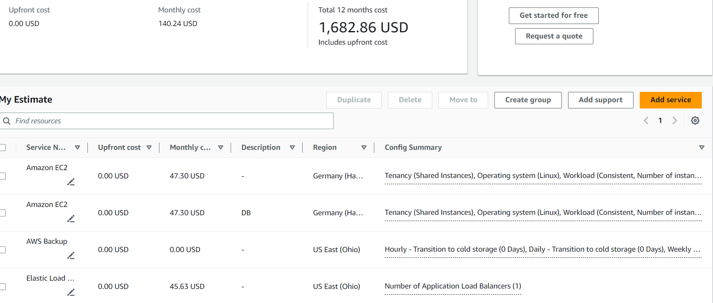
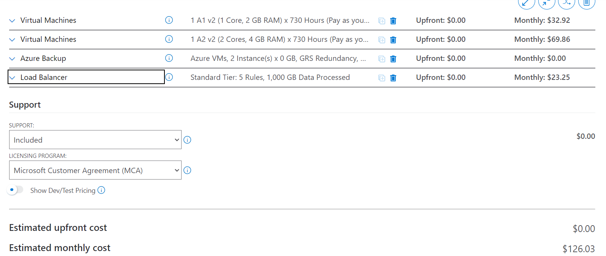
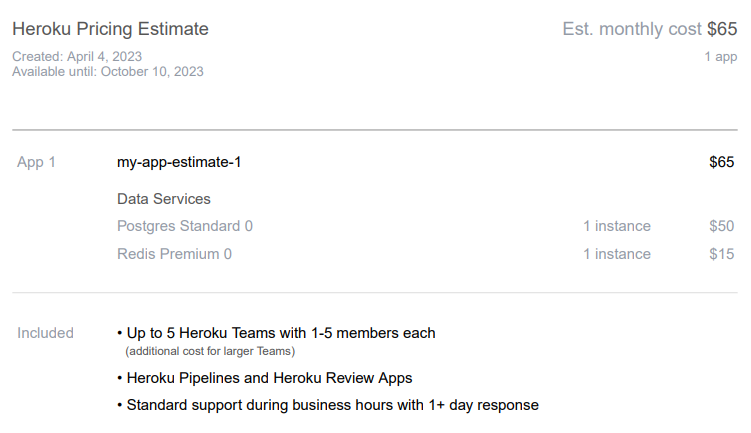
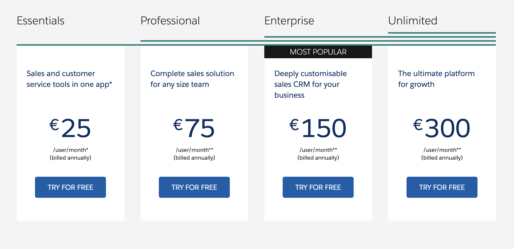

# Dokumentation K05

***
## A.) Kostenberechnung

#### 1.) Rehosting

**AWS Kosten**

Es war nicht möglich, bei AWS die RAM- und andere Werte exakt auszuwählen, weshalb der Webserver mit 2 GB anstatt der gewünschten 1 GB Speicher betrieben wird. Allerdings konnte die genaue Speichermenge bestimmt werden. Beide Instanzen laufen auf einem Linux-Betriebssystem und für den Loadbalancer wurde eine Standardauswahl getroffen. Immerhin war das Einrichten des Backup-Angebots unkompliziert.

**Azure Kosten**

Im Vergleich zu AWS ist Azure in seiner Struktur einfacher aufgebaut, was es Nutzern erleichtert, sich zurechtzufinden. Allerdings können RAM- und CPU-Konfigurationen nicht so dynamisch angepasst werden wie bei AWS, da diese Einstellungen bereits vorgenommen wurden. Das Gleiche gilt für die Speichermengen, die auf herkömmliche Größen wie 64GB, 128GB usw. begrenzt sind. Der Loadbalancer ist jedoch einfach zu bedienen und das Backup kann sehr einfach und präzise konfiguriert werden.

Trotz dieser Vorteile habe ich nach meinen Berechnungen definitiv AWS gewählt. Die AWS-Website ermöglicht es mir, genauere Einstellungen vorzunehmen und eine genaue Kostenübersicht zu erhalten, sodass ich genau weiß, wofür ich bezahle.

***

#### 2.) Replattforming

Ich war bei Heroku unsicher, wo genau das Angebot beginnt und wo es endet. Obwohl ich mich nach bestem Wissen an die angegebenen Informationen gehalten habe, bin ich mir nicht sicher, ob ich nur die Standardversion L, M oder eine andere spezifische Version erhalten habe.

Es ist bekannt, dass Heroku im Vergleich zu Azure oder AWS kombiniert monatlich teurer ist.

***

#### 3.) Repurchasing

Ich habe mich für das Professional-Paket entschieden, da Essentials nur bis zu 10 Mitglieder unterstützt. Allerdings empfand ich die Gestaltung der Webseite als nicht benutzerfreundlich. Um einfache Informationen zu bekommen, musste ich zuerst viele Daten angeben. Das macht es schwierig, wenn man sich nur mal erkundigen will. Das Angebot von Salesforce ist auch nicht so transparent wie das anderer Anbieter. Beim Austausch mit meinen Mitschüler, habe ich gemerkt, dass diese das ganze als ähnlich empfunden haben. Deshalb vermute ich, dass es nicht an mir als Benutzer sondern an Salesforce liegt.

Nach dieser Erfahrung würde ich Salesforce nicht weiterempfehlen und stattdessen nach einem anderen Anbieter suchen.

*Mein Fazit ist, dass: Aus der ganzen Auswahl würde ich zu AWS greifen. Die Monatlichen kosten können mittels langjährigen Plänen klein gehalten werden und wie bereits erwähnt, weiss man wofür man bezahlt.*